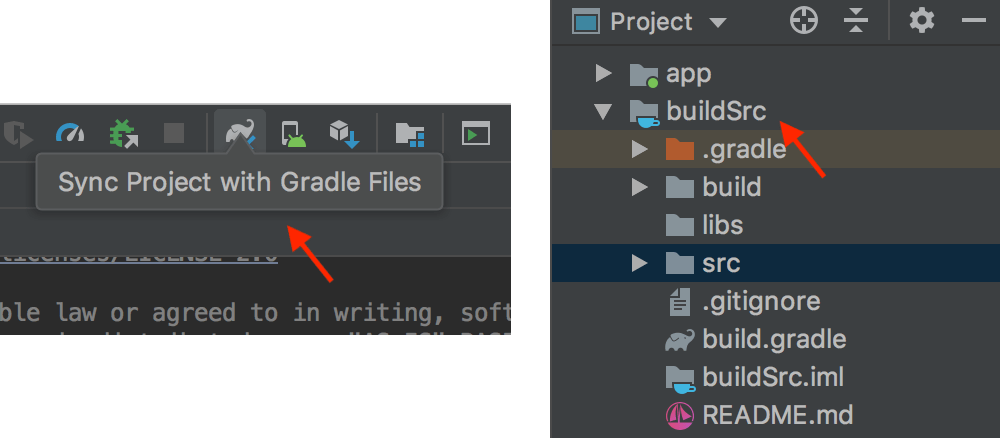

# tpl
Create project form template, such buildSrc plugin

## Install buildSrc template
**Install the buildSrc** into current folder, just copy and past the commands into your terminal

```bash
echo "$(curl -fsSL https://raw.githubusercontent.com/hacktons/tpl/master/install-buildsrc)" | bash
```

**Apply the plugin** into your project:

```groovy
apply plugin: 'com.android.application'
apply plugin: 'hi' // 'hi' is our plugin name 
```


Now your can build/sync within Android Studio, the buildSrc should just work fine;



 